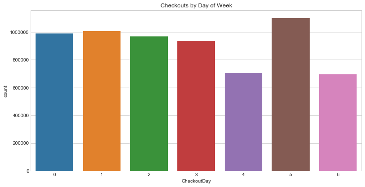

# Exploring monthly and day of week circulation trends

This project's general aim is to analyze a library collection and its checkout records to explore data driven ways of managing library materials. That could be from the procurement side of things by better understanding user preferences or from a logistics perspective of allocating and moving materials to the places they are most needed.

In this blog post we will go over some initial findings from exploring the data.

### What was the total circulation for 2016?

The total circulation from all items in the system for 2016 was 6,404,481. This includes books, DVDs, CDs, wifi hotspots, and in-library device loans.

### How many items were checked out each month? Is there a visible trend?
January has the most checkouts with 581,494 and October has the fewest with 493,663 checkouts. There is, however, only a difference of 87,831 checkouts between the high and low, which is only a 15.1% difference. Based on this we can say that library usage is very steady.

In general, you could say that usage has a downward trend from the beginning of the year to the end but only slightly. A possible explanation for the January spike is that people want to read more as a New Year's resolution. The same phenomenon can be seen with gym usage. The small summer bump could be explained by people looking for "beach reads" or having more free time on vacation.

It would be intersesting to use the full checkout records from 2005-present to see if there are clearer trends. A dataset could be built with just count and checkout time to answer this question. I would like to explore this further at a later date. For now, we will explore the usage for the year further to see if we can corroborate our hunches.

### Why do the monthly checkouts behave the way they do?
Looking at the checkout counts by media type we can see that the media numbers are pretty consistent for the whole year but the print explains most of the fluctuations in total count month to month. This is clearly visible as the shape of total count takes the same shape as the month to month print fluctuations.

Furthermore, in the summer we see that fiction checkouts increase. This perspective perhaps reinforces the idea of a "beach read" or "summer read" boost as people check out novels to enjoy on vacation.

### What do checkouts look like by day of week?
#### Should the library change its hours or close on certain days based on usage?
Monday=0 and Sunday=6 in this numbering scheme. Clearly, Friday and Sunday are the least popular days. Usage is steady during weekdays with only a 6.9% difference between the high and low. Friday, Saturday, and Sunday fluctuate greatly in comparison. The week's peak happens on Saturday with 1,100,314 checkouts.

The peak on Saturday can be explained by people having more time to go to the library when they are off of work and school. People go out on Fridays and rest on Sundays which could explain the very low usage on those days. In addition, the library likely closes earlier on those days or some branches might be closed entirely.

It would be useful to see these numbers on a branch by branch basis but unfortunately that was one of the snags that came when exploring the data. Since the checkouts were only identifiable by a "BibNumber" and it doesn't uniquely identify items at a certain branch, it would be impossible to find the checkout location given the current data. This will greatly limit the research we can perform.

When looking at the format subgroups by day of the week we see that all the bars move together in the same way as general day of week chart. This means that the explanation for day of week trends is probably external and based more on user schedules instead of how those schedules affect their media consumption preferences. Perhaps the simplest answer is the best one, libraries usually have reduced hours on Sunday and Friday. It would be ideal to see how circulation at branches with longer hours on those days compares to those with reduced hours.

In a follow up post, we'll take a look at daily checkout trends for the whole year and see if we can see any seasonal pattens we might have missed.
